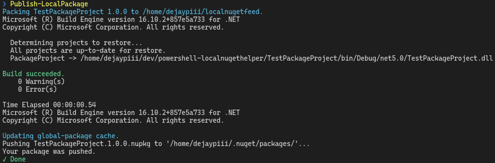

# LocalNuGetHelper [](https://github.com/dejaypiii/powershell-localnugethelper/actions/workflows/test.yml)

LocalNuGetHelper is a powershell module that supports you with a seamless development workflow for your .NET NuGet packages.

## Requirements

- .NET SDK 3.x, 5.x or greater
- Powershell

## Installation

### Powershell

``` pwsh
Install-Module LocalNuGetHelper -Scope CurrentUser
```

## Function `Publish-LocalPackage`

After applying changes to your .NET NuGet package using `Publish-LocalPackage` will let you consume these changes instantly in another project.

### Procedure

1. Creates a directory for the local NuGet path under \<LocalFeedPath>.
2. Adds the directory as a NuGet source with the name \<LocalFeedName>.
3. Packs the C# project of the \<PackageProjectPath> directory and puts the output into the local NuGet source.
4. Purges local global-package cache of a maybe existing package version.
5. Updates the global-package cache with the new package.

### Usage

#### With custom arguments

Windows

``` pwsh
Pubish-LocalPackage -PackageProjectPath .\MyPackageProject -LocalFeedName "My feed name" -LocalFeedPath C:\mydir
```

Posix

``` pwsh
Pubish-LocalPackage -PackageProjectPath ./MyPackageProject -LocalFeedName "My feed name" -LocalFeedPath /home/myuser/mydir
```

#### With default arguments

It will publish the package project from your current location.
The remaining default parameters will be "Local NuGet feed" as your feed name and "localnugetfeed" as a directory in your home/userprofile directory.


``` pwsh
Publish-LocalPackage
```

#### Troubleshooting

If you have any problems executing `Publish-LocalPackage` adding the `Verbose` argument will help you to understand what is going on.
Running in the verbose mode will lead to a lot more and detailed shell output.

``` pwsh
Publish-LocalPackage -Verbose
```

### Output result example



### Details: Interaction with Dotnet and NuGet

`Publish-LocalPackage` uses the *dotnet* CLI to utilize `dotnet` and `dotnet nuget` commands.
Relevant package information (name and version) will be extracted from the *.csproj.

_**Remark:**_ Before the package can be updated in your NuGet global-package cache an already existing cached version gets deleted first because otherwise, the `dotnet nuget push` command will throw an error.

#### Used commands

Action                                 | Command
-------------------------------------- | ----------------------------------------------------------
Get Dotnet version                     | `dotnet --version`
Get current NuGet sources              | `dotnet nuget list sources --format short`
Add a nuget source                     | `dotnet nuget add source <path> -n <name>`
Build project                          | `dotnet build`
Pack package to an output directory    | `dotnet pack <projectPath> -o <localFeedPath> --no-build`
Get global package cache directory     | `dotnet nuget locals global-packages -l`
Delete cached package version          | `Remove-Item <globalPackageCachePath>/<packageName>/<version> -Recurse -Force -ErrorAction Stop`
Update package cache                   | `dotnet nuget push --source <globalPackageCachePath> <packageFromLocalFeed>`

## License

[BSD 2-Clause](LICENSE)

Copyright © 2021 Johann-Peter Duchon
